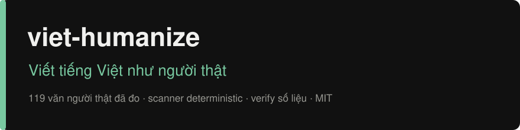

<p align="center"></p>

# viet-humanize

[](LICENSE)
[](https://github.com/cuongducle/viet-humanize)

**Để agent viết tiếng Việt tự nhiên hơn, bớt giống thông cáo báo chí.**

`viet-humanize` là skill biên tập tiếng Việt cho AI agent. Skill giúp bỏ câu sáo, sửa giọng dịch và giữ cách xưng hô nhất quán, nhưng không ép bài kỹ thuật hay caption thành cùng một giọng.

Cài skill để agent dùng khi viết hoặc sửa văn tiếng Việt. Bạn không cần chọn chế độ hay nhớ câu lệnh kích hoạt.

## Xem một ví dụ

**Trước**

> Trong thời đại công nghệ số hóa ngày nay, việc quản lý kho đóng vai trò vô cùng quan trọng. Phần mềm X không chỉ hỗ trợ tra cứu tồn kho mà còn hỗ trợ xuất báo cáo. Phí sử dụng là 9 triệu đồng/năm cho 5 tài khoản. Tuy nhiên, phần mềm chưa hỗ trợ dùng ngoại tuyến.

**Sau**

> Phần mềm X giúp tra cứu tồn kho và xuất báo cáo, giá 9 triệu đồng/năm cho 5 tài khoản. Phần mềm chưa dùng được khi không có mạng.

Bản sau bỏ phần mở đầu chung chung và câu theo khuôn. Giá, số tài khoản, chức năng và giới hạn đều còn nguyên. Không thêm khách hàng giả, thành tích hay số liệu để câu văn nghe thuyết phục hơn.

## Cài đặt

### pi

```bash
pi install git:github.com/cuongducle/viet-humanize
```

### Claude Code

Chạy trong Claude Code:

```text
/plugin marketplace add cuongducle/viet-humanize
/plugin install viet-humanize@viet-humanize
```

Repo có sẵn manifest cho pi và Claude Code. Luồng cài Claude Code chưa được kiểm thử đầu cuối trong repo này.

### Codex và các agent khác

Tải repo về:

```bash
git clone https://github.com/cuongducle/viet-humanize.git
```

Đặt thư mục vào vị trí skill mà agent hỗ trợ, hoặc cấu hình agent nạp [`SKILL.md`](SKILL.md). Giữ cả `scripts/` và `references/` để agent chạy kiểm tra và tra nguồn.

Nếu agent chỉ đọc rules dự án, ghép nội dung [`AGENTS.md`](AGENTS.md) vào file hướng dẫn đang có. Đừng ghi đè quy tắc riêng của dự án. Đây là bản quy tắc rút gọn, không thay thế toàn bộ skill.

Việc tự áp dụng phụ thuộc vào cơ chế nạp skill của từng agent. Clone repo về máy chưa có nghĩa là agent đã nạp nó.

## Dùng như bình thường

Cứ yêu cầu việc bạn muốn làm:

- “Viết một bài giới thiệu tính năng này cho người mới.”
- “Đoạn này nghe cứng quá, sửa lại giúp mình.”
- “Sửa phần giới thiệu trong README.md, giữ nguyên lệnh và link.”
- “Kiểm tra bài này có chỗ nào sáo hoặc lặp ý không.”

Khi được nhờ viết hoặc sửa, agent làm bản mới và ghi ngắn những chỗ đã đổi, chỗ cố ý giữ, chỗ cần bạn đọc lại. Nếu bạn chỉ hỏi kiểm tra, agent chỉ nhận xét, chưa tự sửa.

Có mẫu giọng riêng thì đưa kèm. Skill ưu tiên cách viết của bạn thay vì bắt mọi người theo một giọng có sẵn.

## Skill sửa gì, giữ gì?

| Sửa | Giữ |
|---|---|
| Mở bài dàn cảnh, lời chúc kiểu chatbot | Ý chính, khẳng định và giới hạn của bản gốc |
| Câu kết chỉ nhắc lại đoạn trên | Số liệu, tên riêng và trích dẫn |
| Từ quảng cáo rỗng, chuỗi danh từ khó đọc | Code, URL, đường dẫn và bảng khi sửa file |
| Giọng dịch, chủ thể mơ hồ, đổi xưng hô giữa bài | Giọng người viết và cách xưng hô phù hợp |
| Nhịp câu hoặc cấu trúc lặp không cần thiết | Thuật ngữ quen thuộc như repo, review, feedback |

Không phải cứ gặp từ “triển khai” là đổi thành “làm”. Agent phải đọc cả câu để biết từ đó có đúng nghĩa không. Tương tự, bài kỹ thuật không cần thêm tiếng lóng, còn một lời nhắn cho bạn bè không cần sửa thành văn hành chính.

## Quy trình bên trong

1. **Quét lần đầu.** Script tìm các dấu bề mặt và báo vị trí theo dòng.
2. **Đọc toàn văn.** Agent xét ngữ cảnh, mạch ý và giọng người viết. Máy quét không làm thay bước này.
3. **Viết lại.** Sửa câu và đoạn, giữ thông tin gốc. Thiếu dữ kiện thì hỏi hoặc viết đơn giản hơn, không tự bịa.
4. **Rà lần nữa.** Chạy lại máy quét và đọc lại để bắt câu sáo còn sót hoặc câu mới sửa nghe gượng.
5. **Kiểm bảo toàn khi sửa file.** So bản trước và sau bằng `verify`, rồi rà những khác biệt được báo.

Hướng dẫn đầy đủ nằm trong [`SKILL.md`](SKILL.md). Danh mục dấu hiệu và ví dụ nằm trong [`references/patterns-full.md`](references/patterns-full.md).

## Có dữ liệu nào đứng sau các quy tắc?

Skill tham khảo *Signs of AI writing* của WikiProject AI Cleanup, nghiên cứu ViDetect trên 6.800 bài luận tiếng Việt và các nguồn bản địa. Repo cũng có những phép đo riêng, tách văn trang trọng khỏi văn trò chuyện.

Tập Threads gồm **77 bài được tuyển chọn vào nhóm văn người, 12 bộ trả lời và 30 bài AI cùng chủ đề**, phủ 19 chủ đề đời sống. Một phép đối chiếu bổ sung dùng số tổng hợp từ **16.319 bình luận nhãn CLEAN của ViHSD**. Văn bản ViHSD không được đưa vào repo.

Một vài kết quả đáng chú ý:

| Phép đo | Kết quả | Ý nghĩa khi biên tập |
|---|---|---|
| Điểm scan tổng hợp trên tập thử văn trang trọng | AUC 0,529 | Gần mức ngẫu nhiên, không dùng để kết luận tác giả là AI |
| Điểm scan tổng hợp trên tập Threads | AUC 0,661 | Có khác biệt trong mẫu, vẫn không đủ làm bộ phát hiện AI |
| Độ biến thiên độ dài câu trên Threads | AUC 0,512 | Không áp ngưỡng của văn trang trọng cho chat |
| Tỷ lệ nén zlib trên Threads | AUC 0,920 | Tín hiệu phân tách mạnh trong mẫu này, không phải mục tiêu để viết theo |
| Có trợ từ cuối câu | 27/77 bài nhóm người, 3/30 bài AI, 7/12 bộ trả lời | Xét theo ngữ cảnh, không rải “nhé”, “ạ”, “đấy” để đạt chỉ tiêu |

AUC đo mức phân tách hai nhóm trong tập khảo sát. **AUC 0,920 không có nghĩa là skill viết hay hơn 92% hay nhận diện đúng 92% văn bản.** Các phép đo này cũng chưa chứng minh chất lượng bản viết lại tăng bao nhiêu.

Tập Threads còn nhỏ, được tuyển chọn thủ công và không thể loại trừ hoàn toàn bài có AI hỗ trợ. Phía AI chỉ gồm một mô hình ở cách viết mặc định. Kết quả không đại diện cho toàn bộ tiếng Việt hoặc mọi mô hình.

Đọc nguồn và kết quả đầy đủ:

- [Nguồn trích dẫn và khoảng trống nghiên cứu](references/sources.md)
- [Phương pháp xây dựng skill](references/methodology.md)
- [Phép đo trên tập thử ban đầu](references/calibration.md)
- [Đánh giá v2](references/eval-v2.md) và [đối chiếu với Luna](references/eval-luna.md)
- [Đánh giá Threads và đối chiếu ViHSD](references/eval-threads.md)
- [Nguồn dữ liệu và quy trình thu Threads](references/threads-data.md)

## Máy quét đi kèm

Chỉ cần Python 3 và thư viện chuẩn, không cần cài thêm thư viện. Chạy từ thư mục repo:

```bash
python3 scripts/vi_scan.py scan FILE.md
python3 scripts/vi_scan.py verify TRUOC.md SAU.md
python3 scripts/vi_scan.py selftest
python3 scripts/vi_scan.py calibrate corpus/human corpus/ai
```

- `scan`: báo điểm dấu bề mặt từ 0 đến 100, vị trí cần xem và các chỉ số ngôn ngữ.
- `verify`: so số/ngày, URL, code và frontmatter giữa hai bản. Cả phần thêm lẫn phần mất đều được báo.
- `selftest`: chạy kiểm tra tích hợp của script.
- `calibrate`: đo khả năng phân tách của từng chỉ số trên hai thư mục văn mẫu.

`verify` không hiểu nghĩa câu, không kiểm chứng sự thật và không đảm bảo tên riêng hay khẳng định được giữ đúng. Agent vẫn phải đọc đối chiếu. **Điểm scan 0 cũng chỉ có nghĩa là không tìm thấy dấu đã lập danh mục**, không chứng minh đây là văn người.

## Giới hạn

Đây là công cụ biên tập, không phải công cụ xác định tác giả hay dịch vụ vượt detector. Skill không hứa qua Turnitin hoặc bất kỳ bộ dò nào.

Không thêm lỗi chính tả để giả làm người. Không tự tạo nguồn, trải nghiệm cá nhân hoặc số liệu. Các dấu hiệu chỉ có ích khi xét đúng loại văn, không phải danh sách từ cấm dùng cho mọi trường hợp.

Bạn vẫn nên đọc bản cuối, nhất là nội dung có số liệu, trích dẫn hoặc thuật ngữ chuyên môn.

## Cấu trúc repo

| Đường dẫn | Nội dung |
|---|---|
| [`SKILL.md`](SKILL.md) | Quy trình và quy tắc đầy đủ cho agent |
| [`AGENTS.md`](AGENTS.md) | Bản quy tắc rút gọn |
| [`scripts/vi_scan.py`](scripts/vi_scan.py) | Máy quét và các lệnh kiểm tra |
| [`references/`](references/) | Danh mục dấu hiệu, nguồn và báo cáo đánh giá |
| [`corpus/`](corpus/) | Văn mẫu dùng trong các phép đo |
| [`research/`](research/) | Script thu thập và đánh giá |
| [`.claude-plugin/`](.claude-plugin/) | Manifest plugin và marketplace cho Claude Code |
| [`package.json`](package.json) | Thông tin gói và cấu hình skill cho pi |

## Đóng góp

Gặp chỗ skill sửa sai giọng hoặc làm lệch nghĩa? [Mở issue](https://github.com/cuongducle/viet-humanize/issues) kèm đoạn trước, đoạn sau và ngữ cảnh sử dụng. Nhớ bỏ thông tin riêng tư trước khi gửi.

Khi đề xuất dấu hiệu mới, thêm ví dụ có nguồn vào `references/patterns-full.md`. Ghi rõ đó là quan sát, giả thuyết hay kết quả đã đo. Nếu đổi quy tắc trong `SKILL.md`, cập nhật cả `AGENTS.md`.

Trước khi gửi thay đổi:

```bash
python3 scripts/vi_scan.py selftest
python3 scripts/vi_scan.py scan README.md
git diff --check
```

README có ví dụ cố ý chứa dấu văn theo khuôn nên máy quét có thể báo cờ. Đọc từng cờ, đừng sửa ví dụ chỉ để hạ điểm.

## Giấy phép

[MIT](LICENSE).
